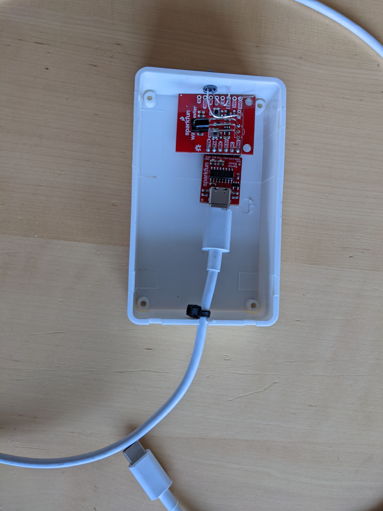

# HiFi Remote

This is a very simple Android app to serve as remote control for my NAD amplifier and Denon CD Player.
It uses the [Sparkfun WiFi IR Blaster](https://www.sparkfun.com/products/15031) to do the
actual IR transmission.

The code for the Arduino can be found at 
[WiFiBlaster Code](https://github.com/heimir-sverrisson/WiFiIRBlaster)

The hardware is shown below:

